# Patrons Arquitectònics i de Disseny

Aquest document detalla els patrons arquitectònics i de disseny utilitzats en el projecte **Refugis Lliures Frontend**.

---

## Índex

1. [Patrons Arquitectònics](#patrons-arquitectònics)
   - [Layered Architecture (Arquitectura per Capes)](#1-layered-architecture-arquitectura-per-capes)
   - [Component-Based Architecture](#2-component-based-architecture)
   - [Container/Presentational Pattern](#3-containerpresentational-pattern)
   - [Flux Unidireccional de Dades](#4-flux-unidireccional-de-dades)
2. [Patrons de Disseny](#patrons-de-disseny)
   - [Repository Pattern](#1-repository-pattern)
   - [Data Transfer Object (DTO)](#2-data-transfer-object-dto)
   - [Mapper Pattern](#3-mapper-pattern)
   - [Provider Pattern (Context)](#4-provider-pattern-context)
   - [Custom Hook Pattern](#5-custom-hook-pattern)
   - [Facade Pattern](#6-facade-pattern)
   - [Observer Pattern](#7-observer-pattern)
   - [Singleton Pattern](#8-singleton-pattern)
   - [Strategy Pattern](#9-strategy-pattern)
   - [Decorator Pattern (Interceptor)](#10-decorator-pattern-interceptor)
   - [Optimistic Update Pattern](#11-optimistic-update-pattern)
   - [Composite Pattern](#12-composite-pattern)

---

## Patrons Arquitectònics

### 1. Layered Architecture (Arquitectura per Capes)

**Descripció:** L'aplicació segueix una arquitectura en capes clarament definida que separa les responsabilitats.

**On s'utilitza:** Estructura general del projecte (`src/`)

**Capes identificades:**
```
┌─────────────────────────────────────────────────────────────┐
│                    PRESENTATION LAYER                        │
│  (screens/, components/)                                     │
│  MapScreen, RefugeDetailScreen, RefugeCard, FilterPanel...  │
├─────────────────────────────────────────────────────────────┤
│                    APPLICATION LAYER                         │
│  (hooks/, contexts/)                                         │
│  useRefugesQuery, useAuth, AuthContext, useCustomAlert...   │
├─────────────────────────────────────────────────────────────┤
│                    DOMAIN LAYER                              │
│  (models/)                                                   │
│  Location, User, Renovation, Coord, Filters...              │
├─────────────────────────────────────────────────────────────┤
│                    DATA LAYER                                │
│  (services/, dto/, mappers/)                                 │
│  RefugisService, apiClient, RefugiDTO, RefugiMapper...      │
└─────────────────────────────────────────────────────────────┘
```

---

### 2. Component-Based Architecture

**Descripció:** React Native utilitza una arquitectura basada en components reutilitzables i composables.

**On s'utilitza:** Tot el directori `src/components/` i `src/screens/`

**Components principals:**
- `AppNavigator.tsx` - Navegació principal
- `TabsNavigator.tsx` - Navegació per pestanyes
- `RefugeCard.tsx` - Targeta de refugi reutilitzable
- `FilterPanel.tsx` - Panell de filtres
- `CustomAlert.tsx` - Alertes personalitzades
- `RefugeBottomSheet.tsx` - Bottom sheet per detalls

---

### 3. Container/Presentational Pattern

**Descripció:** Separació entre components que gestionen lògica (containers/screens) i components que només renderitzen UI (presentational).

**On s'utilitza:**
- **Containers:** `MapScreen.tsx`, `RefugeDetailScreen.tsx`, `RenovationsScreen.tsx`
- **Presentational:** `RefugeCard.tsx`, `BadgeType.tsx`, `BadgeCondition.tsx`

---

### 4. Flux Unidireccional de Dades

**Descripció:** Les dades flueixen en una sola direcció: de pares a fills via props, i els canvis es propaguen via callbacks.

**On s'utilitza:** Tota l'aplicació segueix aquest patró, especialment amb:
- React Query per gestió d'estat del servidor
- Context API per estat global
- Props per comunicació pare-fill

---

## Patrons de Disseny

### 1. Repository Pattern

**Descripció:** Abstracció que encapsula la lògica d'accés a dades, proporcionant una interfície unificada per a les operacions CRUD.

**On s'utilitza:** 
- `src/services/RefugisService.ts`
- `src/services/UsersService.ts`
- `src/services/RenovationService.ts`
- `src/services/DoubtsService.ts`
- `src/services/ExperienceService.ts`

**Diagrama de Seqüència:**

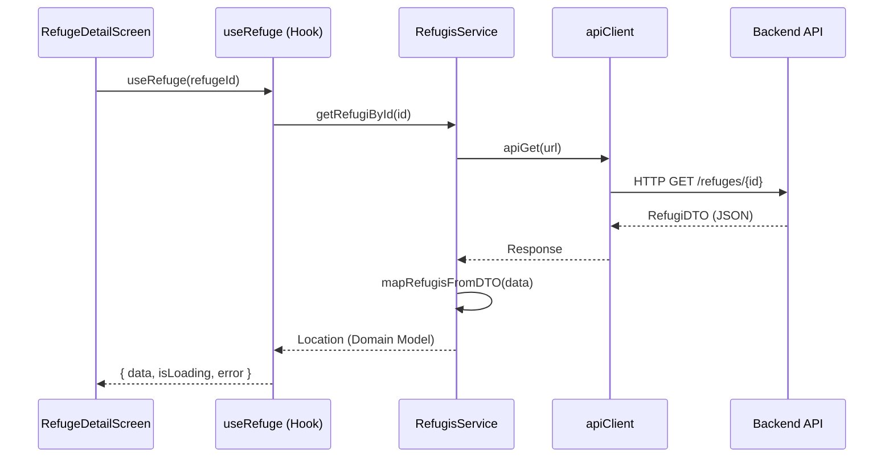

---

### 2. Data Transfer Object (DTO)

**Descripció:** Objectes que transporten dades entre capes, específicament des del backend fins a l'aplicació.

**On s'utilitza:** `src/services/dto/`
- `RefugiDTO.ts` - DTOs per refugis
- `UserDTO.ts` - DTOs per usuaris
- `RenovationDTO.ts` - DTOs per renovacions
- `DoubtDTO.ts` - DTOs per dubtes
- `ExperienceDTO.ts` - DTOs per experiències
- `RefugeProposalDTO.ts` - DTOs per propostes

**Diagrama de Seqüència:**

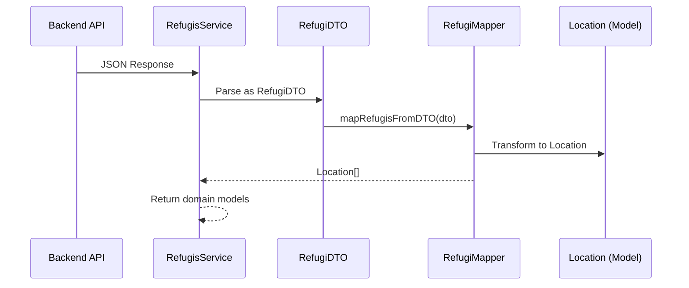

---

### 3. Mapper Pattern

**Descripció:** Converteix objectes d'un tipus a un altre, especialment de DTOs a models de domini.

**On s'utilitza:** `src/services/mappers/`
- `RefugiMapper.ts` - `mapRefugisFromDTO()`, `mapCoordFromDTO()`
- `UserMapper.ts` - `mapUserFromDTO()`
- `RenovationMapper.ts` - `mapRenovationFromDTO()`
- `DoubtMapper.ts` - `mapDoubtFromDTO()`, `mapAnswerFromDTO()`
- `ExperienceMapper.ts` - `mapExperienceFromDTO()`
- `RefugeProposalMapper.ts` - Mapeja propostes

**Diagrama de Seqüència:**

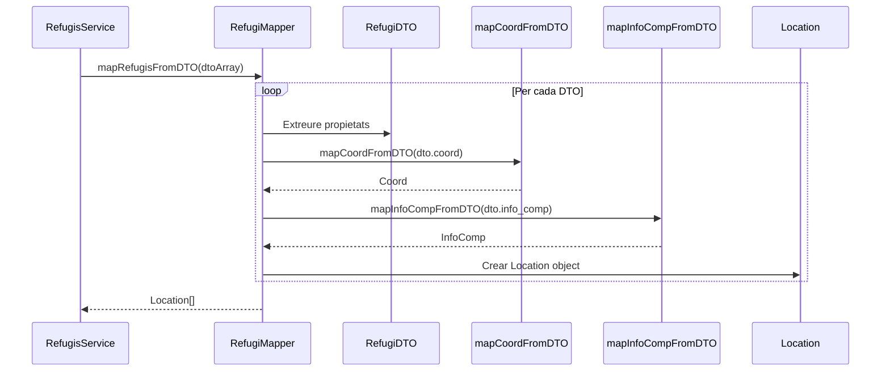

---

### 4. Provider Pattern (Context)

**Descripció:** Proporciona dades a través de l'arbre de components sense passar props manualment.

**On s'utilitza:**
- `src/contexts/AuthContext.tsx` - Estat d'autenticació global
- `QueryClientProvider` de React Query - Cache de dades
- `SafeAreaProvider` - Àrees segures
- `NavigationContainer` - Context de navegació

**Diagrama de Seqüència:**

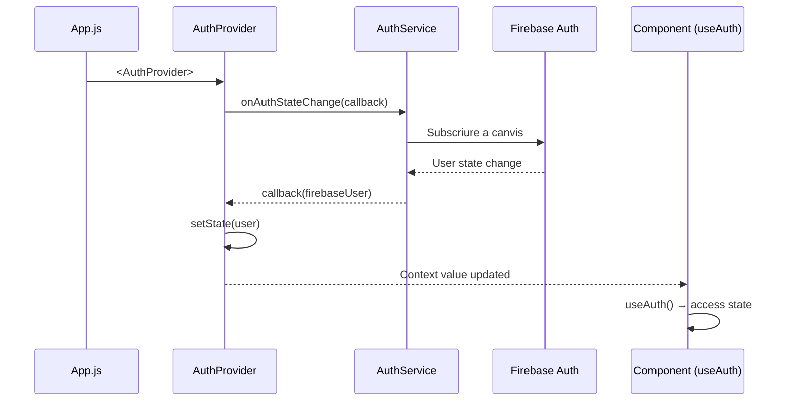

---

### 5. Custom Hook Pattern

**Descripció:** Encapsula lògica reutilitzable en hooks personalitzats.

**On s'utilitza:** `src/hooks/`
- `useRefugesQuery.ts` - Hooks per refugis (useRefuges, useRefuge, useRefugesBatch)
- `useProposalsQuery.ts` - Hooks per propostes
- `useRenovationsQuery.ts` - Hooks per renovacions
- `useDoubtsQuery.ts` - Hooks per dubtes
- `useFavourite.ts` - Gestió de favorits
- `useVisited.ts` - Gestió de visitats
- `useCustomAlert.ts` - Alertes personalitzades
- `useTranslation.ts` - Traduccions

**Diagrama de Seqüència:**

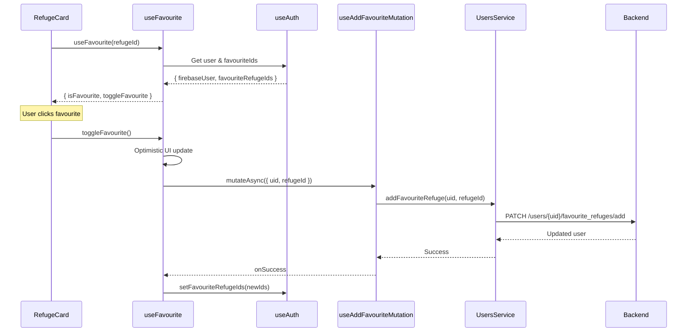

---

### 6. Facade Pattern

**Descripció:** Proporciona una interfície simplificada per a un subsistema complex.

**On s'utilitza:**
- `src/services/apiClient.ts` - Façana per a peticions HTTP
- `src/services/AuthService.ts` - Façana per Firebase Auth

**Diagrama de Seqüència:**

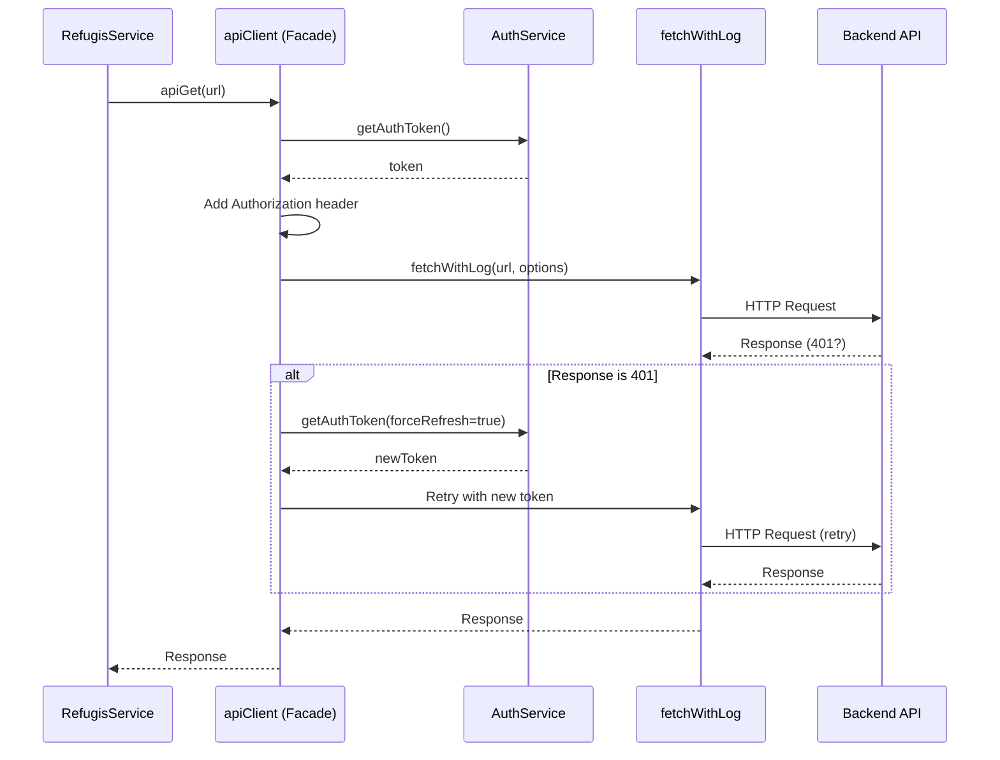

---

### 7. Observer Pattern

**Descripció:** Permet que objectes s'subscriguin a esdeveniments i siguin notificats de canvis.

**On s'utilitza:**
- Firebase `onAuthStateChanged` a `AuthContext.tsx`
- React Query's query invalidation
- React Navigation's event listeners

**Diagrama de Seqüència:**

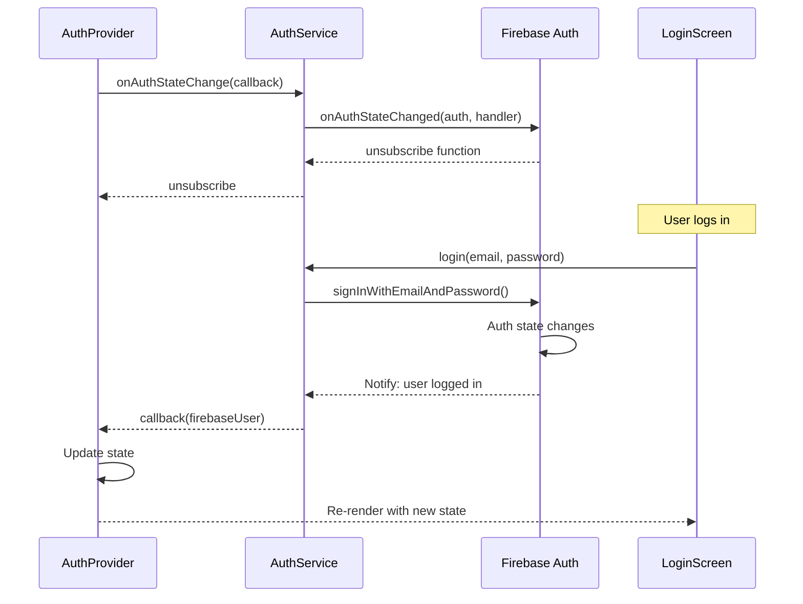

---

### 8. Singleton Pattern

**Descripció:** Assegura que una classe tingui només una instància i proporciona un punt d'accés global.

**On s'utilitza:**
- `src/config/queryClient.ts` - Única instància de QueryClient
- `src/i18n/index.ts` - Única instància de i18n
- Firebase `auth` instance

**Diagrama de Seqüència:**

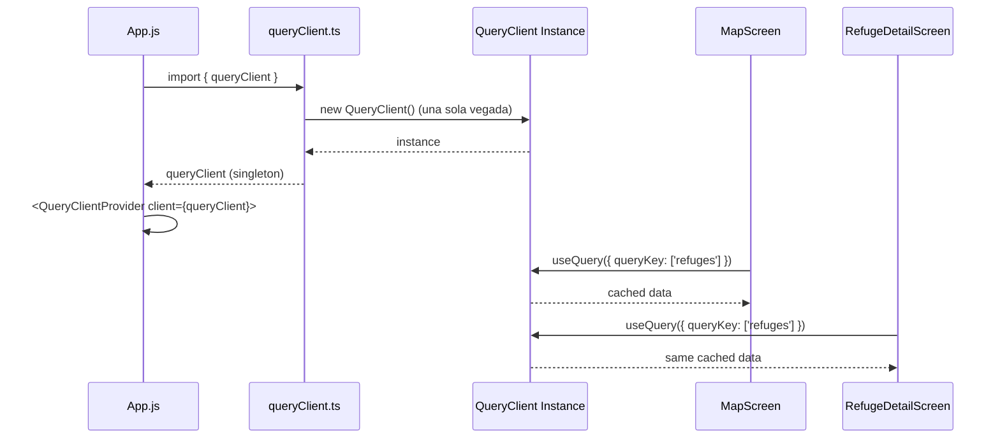

---

### 9. Strategy Pattern

**Descripció:** Defineix una família d'algorismes intercanviables encapsulats.

**On s'utilitza:**
- `src/i18n/` - Estratègies de traducció (ca, es, en, fr)
- Validació de formularis a `SignUpScreen.tsx`
- Tipus de mapes a `LayerSelector.tsx`

**Diagrama de Seqüència:**

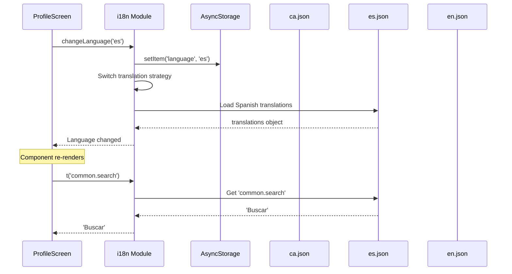

---

### 10. Decorator Pattern (Interceptor)

**Descripció:** Afegeix funcionalitat addicional a un objecte de manera dinàmica.

**On s'utilitza:**
- `src/services/fetchWithLog.ts` - Logging de peticions HTTP
- `src/services/apiClient.ts` - Interceptor per token refresh
- `index.js` - Decoració de `global.fetch`

**Diagrama de Seqüència:**

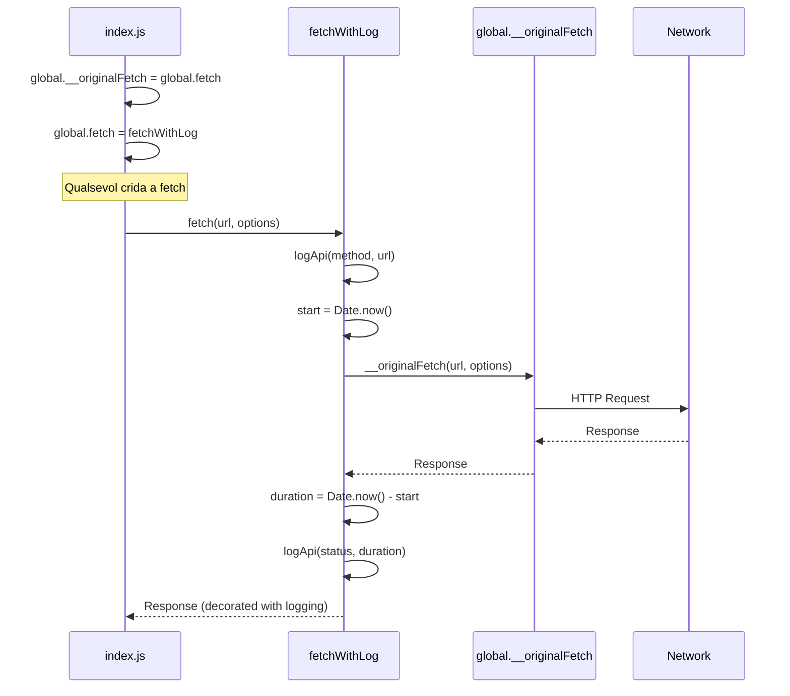

---

### 11. Optimistic Update Pattern

**Descripció:** Actualitza la UI immediatament abans de confirmar amb el servidor, revertint si falla.

**On s'utilitza:**
- `src/hooks/useFavourite.ts` - Toggle favorits
- `src/hooks/useVisited.ts` - Marcar com visitat
- `src/hooks/useProposalsQuery.ts` - Aprovar/Rebutjar propostes
- `src/hooks/useDoubtsQuery.ts` - Crear/Eliminar dubtes

**Diagrama de Seqüència:**

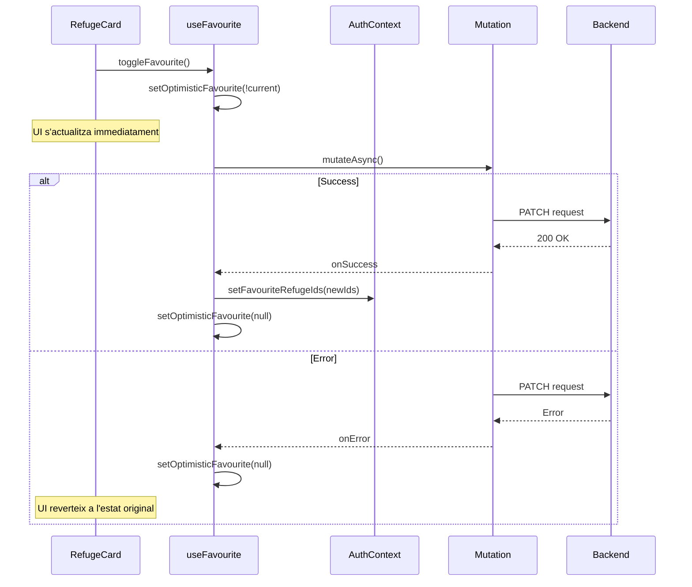

---

### 12. Composite Pattern

**Descripció:** Compon objectes en estructures d'arbre per representar jerarquies part-tot.

**On s'utilitza:**
- Estructura de navegació (`AppNavigator` → `TabsNavigator` → `Screens`)
- Composició de components UI (screens amb múltiples components)
- Estructura de providers a `App.js`

**Diagrama de Seqüència:**

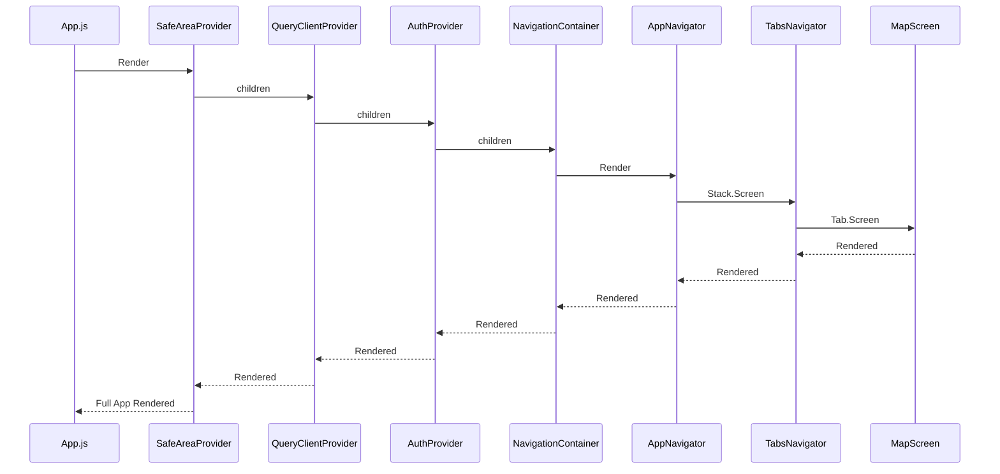

---

## Resum de Patrons

| Tipus | Patró | Ubicació Principal |
|-------|-------|-------------------|
| Arquitectònic | Layered Architecture | `src/` estructura |
| Arquitectònic | Component-Based | `components/`, `screens/` |
| Arquitectònic | Container/Presentational | `screens/` vs `components/` |
| Arquitectònic | Flux Unidireccional | Tot el projecte |
| Disseny | Repository | `services/*.ts` |
| Disseny | DTO | `services/dto/` |
| Disseny | Mapper | `services/mappers/` |
| Disseny | Provider (Context) | `contexts/`, `App.js` |
| Disseny | Custom Hook | `hooks/` |
| Disseny | Facade | `apiClient.ts`, `AuthService.ts` |
| Disseny | Observer | Firebase Auth, React Query |
| Disseny | Singleton | `queryClient.ts`, `i18n/` |
| Disseny | Strategy | `i18n/locales/` |
| Disseny | Decorator | `fetchWithLog.ts`, `apiClient.ts` |
| Disseny | Optimistic Update | `useFavourite.ts`, hooks de mutació |
| Disseny | Composite | Estructura de navegació i providers |

---

## Diagrama General de l'Arquitectura

```
┌─────────────────────────────────────────────────────────────────────────────┐
│                              PRESENTATION                                    │
│  ┌─────────────┐  ┌─────────────┐  ┌─────────────┐  ┌─────────────┐        │
│  │ MapScreen   │  │RefugeDetail │  │ Renovations │  │  Profile    │        │
│  └──────┬──────┘  └──────┬──────┘  └──────┬──────┘  └──────┬──────┘        │
│         │                │                │                │                │
│  ┌──────┴────────────────┴────────────────┴────────────────┴──────┐        │
│  │                     REUSABLE COMPONENTS                         │        │
│  │  RefugeCard | FilterPanel | CustomAlert | BadgeType | ...       │        │
│  └─────────────────────────────┬───────────────────────────────────┘        │
└────────────────────────────────┼────────────────────────────────────────────┘
                                 │
┌────────────────────────────────┼────────────────────────────────────────────┐
│                          APPLICATION                                         │
│  ┌─────────────────────────────┴───────────────────────────────────┐        │
│  │                        CUSTOM HOOKS                              │        │
│  │  useRefugesQuery | useFavourite | useAuth | useTranslation ...   │        │
│  └─────────────────────────────┬───────────────────────────────────┘        │
│                                │                                             │
│  ┌─────────────────────────────┴───────────────────────────────────┐        │
│  │                        CONTEXTS                                  │        │
│  │              AuthContext | QueryClientProvider                   │        │
│  └─────────────────────────────┬───────────────────────────────────┘        │
└────────────────────────────────┼────────────────────────────────────────────┘
                                 │
┌────────────────────────────────┼────────────────────────────────────────────┐
│                            DOMAIN                                            │
│  ┌─────────────────────────────┴───────────────────────────────────┐        │
│  │                         MODELS                                   │        │
│  │   Location | User | Renovation | Doubt | Experience | Coord...  │        │
│  └─────────────────────────────────────────────────────────────────┘        │
└─────────────────────────────────────────────────────────────────────────────┘
                                 │
┌────────────────────────────────┼────────────────────────────────────────────┐
│                             DATA                                             │
│  ┌───────────────┐  ┌───────────────┐  ┌───────────────┐                    │
│  │   SERVICES    │  │    MAPPERS    │  │     DTOs      │                    │
│  │ RefugisService│  │ RefugiMapper  │  │  RefugiDTO    │                    │
│  │ UsersService  │  │ UserMapper    │  │  UserDTO      │                    │
│  │ AuthService   │  │ ...           │  │  ...          │                    │
│  └───────┬───────┘  └───────────────┘  └───────────────┘                    │
│          │                                                                   │
│  ┌───────┴───────┐                                                          │
│  │   apiClient   │ ◄─── Facade + Decorator (logging + token refresh)        │
│  └───────┬───────┘                                                          │
└──────────┼──────────────────────────────────────────────────────────────────┘
           │
           ▼
    ┌─────────────┐
    │   Backend   │
    │     API     │
    └─────────────┘
```

---

*Document generat per a l'anàlisi arquitectònic del projecte Refugis Lliures Frontend - TFG*
