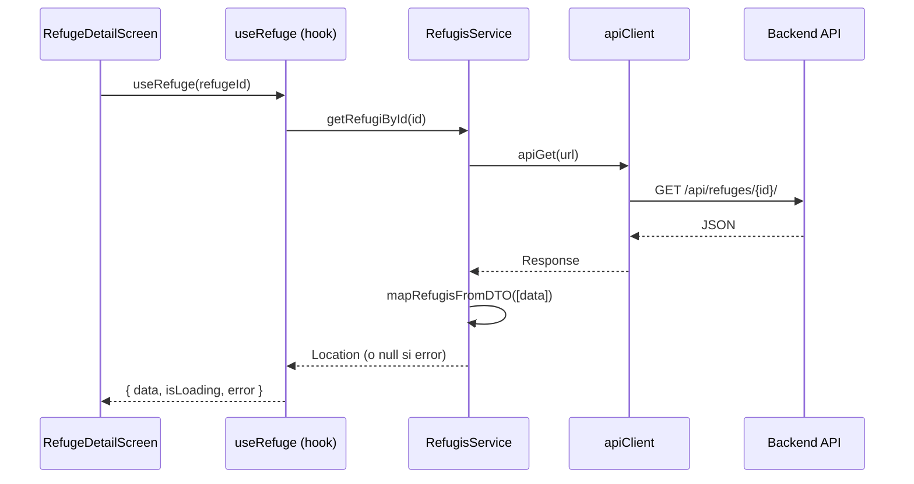
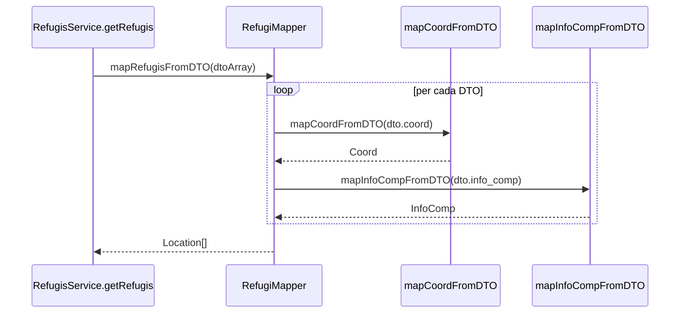
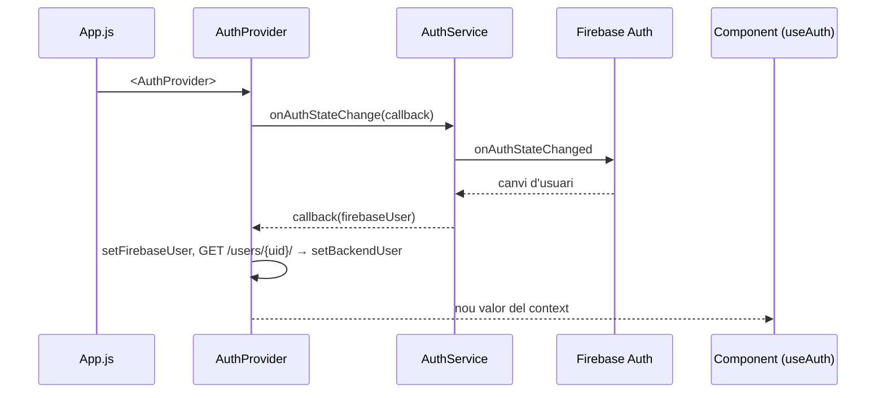
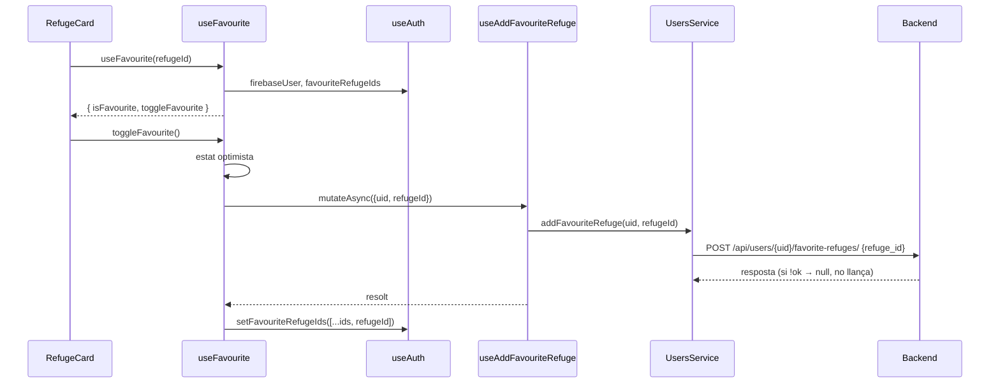
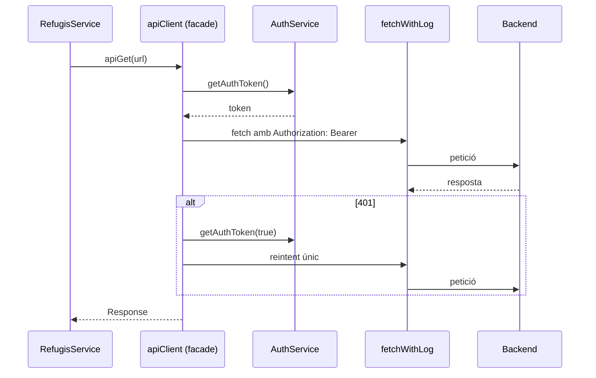
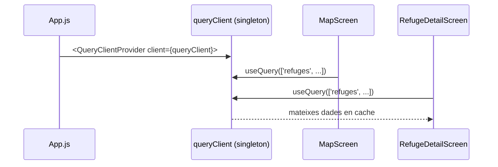
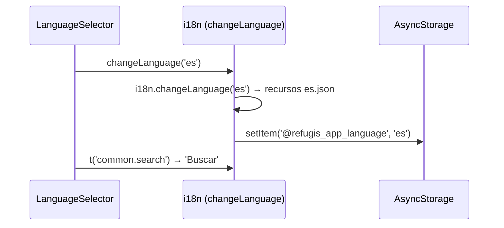
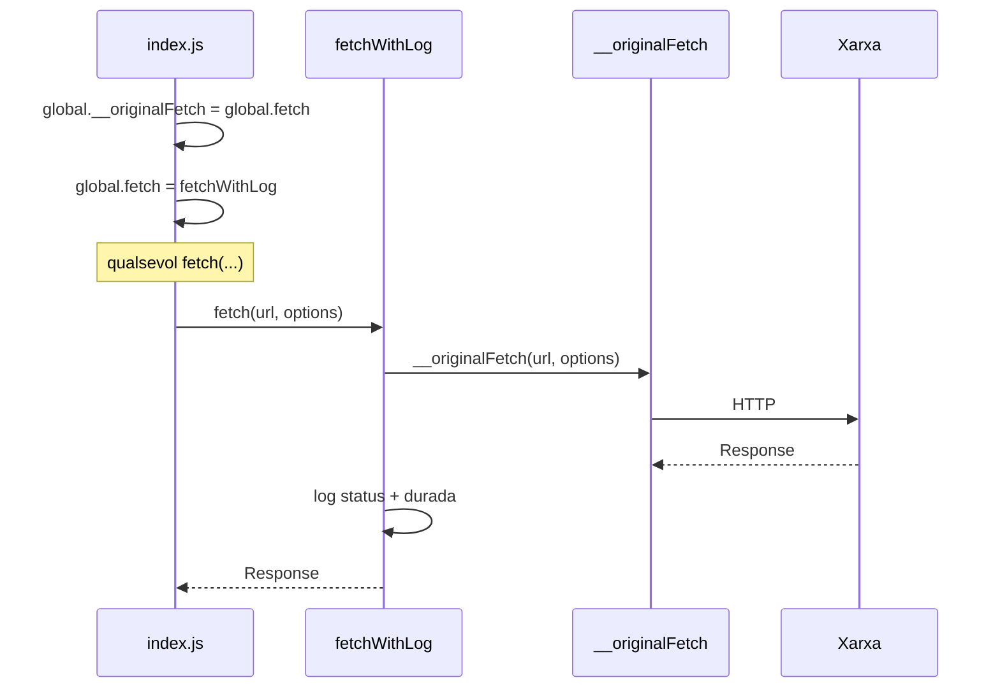
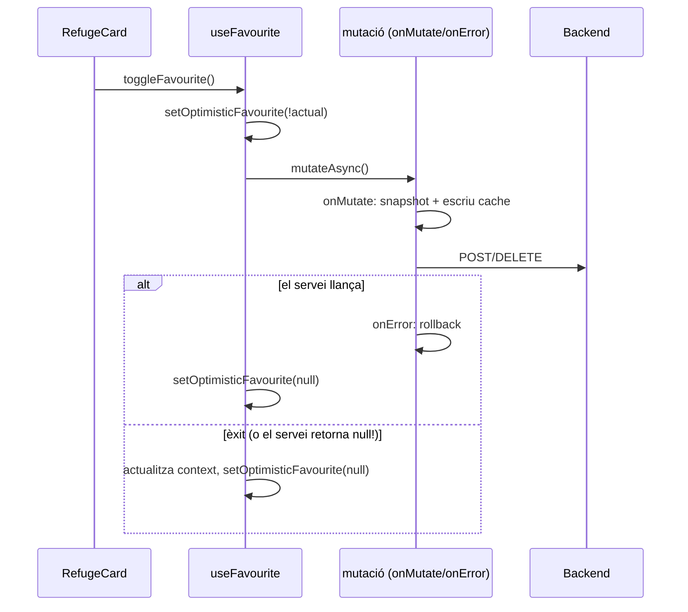

# Patrons arquitectònics i de disseny

> Migrat i corregit des de l'antiga `README/PATRONS_ARQUITECTONICS_I_DISSENY.md` (octubre 2026). Document fill de [ARCHITECTURE.md §3](../ARCHITECTURE.md#3-capes-patró-de-referència-renovations).
> Llegenda: **[FET]** comprovat al codi · **[INFERÈNCIA]** deducció.
>
> **Correccions respecte a l'original** [FET]: (1) on es fa el mapatge DTO→model és **mixt**: `RefugisService`, `UsersService`, `RefugeProposalsService` i `RefugeVisitService` mapegen dins el servei, mentre que renovations, experiències i dubtes retornen DTO i mapegen al hook (el patró de referència, vegeu [ARCHITECTURE §3](../ARCHITECTURE.md)); (2) preferits usen `POST`/`DELETE /users/{uid}/favorite-refuges/`, no `PATCH .../favourite_refuges/add`; (3) `UsersService` retorna `null` en error, de manera que la branca d'error de l'optimistic update gairebé mai s'executa; (4) l'idioma es desa a la clau `@refugis_app_language`.

## Índex
- Arquitectònics: [capes](#1-arquitectura-per-capes) · [components](#2-arquitectura-basada-en-components) · [container/presentational](#3-containerpresentational) · [flux unidireccional](#4-flux-unidireccional-de-dades)
- Disseny: [Repository](#5-repository) · [DTO](#6-data-transfer-object-dto) · [Mapper](#7-mapper) · [Provider](#8-provider-context) · [Custom hook](#9-custom-hook) · [Facade](#10-facade) · [Observer](#11-observer) · [Singleton](#12-singleton) · [Strategy](#13-strategy) · [Decorator / interceptor](#14-decorator--interceptor) · [Optimistic update](#15-optimistic-update) · [Composite](#16-composite)
- [Resum](#resum)

---

## Patrons arquitectònics

### 1. Arquitectura per capes
Separació de responsabilitats a `src/`:
```
┌──────────────────────────────────────────────────────────────┐
│ PRESENTACIÓ   screens/, components/                          │
│   MapScreen, RefugeDetailScreen, RefugeCard, FilterPanel…    │
├──────────────────────────────────────────────────────────────┤
│ APLICACIÓ     hooks/, contexts/, config/queryClient.ts        │
│   useRefugesQuery, useFavourite, useCustomAlert, AuthContext │
├──────────────────────────────────────────────────────────────┤
│ DOMINI        models/index.ts                                │
│   Location (refugi), User, Renovation, Coord, Filters…       │
├──────────────────────────────────────────────────────────────┤
│ DADES         services/, services/dto/, services/mappers/    │
│   RefugisService, apiClient, fetchWithLog, RefugiDTO, mappers│
└──────────────────────────────────────────────────────────────┘
```
Excepcions al patró (fetch directe, serveis cridats des de la UI): [ARCHITECTURE §8](../ARCHITECTURE.md#8-excepcions-al-patró-fet).

### 2. Arquitectura basada en components
Components reutilitzables i composables a `src/components/` i `src/screens/`: `AppNavigator`, `TabsNavigator`, `RefugeCard`, `FilterPanel`, `CustomAlert`, `RefugeBottomSheet`, `LeafletWebMap`…

### 3. Container/Presentational
- **Containers** (dades, hooks, navegació): `MapScreen`, `RefugeDetailScreen`, `RenovationsScreen`.
- **Presentacionals** (només props): `RefugeCard`, `BadgeType`, `BadgeCondition`.
La separació no és estricta: alguns components (p. ex. `QuickActionsMenu`, `PhotoViewerModal`, `AvatarPopup`) criden serveis directament **[FET]**.

### 4. Flux unidireccional de dades
Dades de pares a fills per props; canvis cap amunt per callbacks. L'estat del servidor viu a React Query i l'estat de sessió a `AuthContext`.

---

## Patrons de disseny

### 5. Repository
Els serveis encapsulen l'accés al backend amb una interfície per domini: `RefugisService`, `UsersService`, `RenovationService`, `DoubtsService`, `ExperienceService`, `RefugeProposalsService`, `RefugeVisitService`, `RefugeMediaService`.



### 6. Data Transfer Object (DTO)
Interfícies amb la forma exacta del JSON del backend (snake_case) a `src/services/dto/`: `RefugiDTO`, `UserDTO`, `RenovationDTO`, `DoubtDTO`, `ExperienceDTO`, `RefugeProposalDTO`… Desacoblen el model de domini del contracte HTTP.

### 7. Mapper
Funcions pures DTO → model a `src/services/mappers/` (`mapRefugiFromDTO`, `mapCoordFromDTO`, `mapInfoCompFromDTO`, `mapUserFromDTO`, `mapRenovationFromDTO`, `mapDoubtFromDTO`, `mapAnswerFromDTO`, `mapExperienceFromDTO`, propostes) i alguna inversa (`mapPartialRefugiToDTO`). El mapper actua de **filtre**: un camp que no hi és no arriba a la UI. Es crida des del servei (refugis, usuaris, propostes, visites) o des del hook (renovations, experiències, dubtes).



### 8. Provider (Context)
Dades disponibles a tot l'arbre sense prop drilling: `AuthProvider` (`src/contexts/AuthContext.tsx`), `QueryClientProvider`, `SafeAreaProvider`, `NavigationContainer`.



### 9. Custom hook
Lògica reutilitzable a `src/hooks/`: `useRefugesQuery`, `useProposalsQuery`, `useRenovationsQuery`, `useDoubtsQuery`, `useExperiencesQuery`, `useUsersQuery`, `useFavourite`, `useVisited`, `useCustomAlert`, `useTranslation`.



### 10. Facade
Interfície simple sobre subsistemes complexos:
- `apiClient` (`apiGet/apiPost/apiPatch/apiPut/apiDelete`): token, capçaleres, JSON i reintent en 401.
- `AuthService`: totes les operacions de Firebase Auth i Google Sign-In.



### 11. Observer
Subscripció a canvis: `onAuthStateChanged` a `AuthContext`, invalidació de queries de React Query (els components subscrits es tornen a renderitzar), listeners de React Navigation (`focus`, `blur`) i `NetInfo` a `App.js`.

### 12. Singleton
Una sola instància compartida: `queryClient` (`src/config/queryClient.ts`), `i18n` (`src/i18n/index.ts`), `auth` de Firebase (`src/services/firebase.ts`). Els serveis són classes amb mètodes `static` (sense instàncies).



### 13. Strategy
Algorismes intercanviables: locales d'i18n (ca/es/en/fr), capes del mapa (OpenTopoMap / OpenStreetMap, `LayerSelector`) i representació de marcadors (cluster / heatmap / markers) a `LeafletWebMap`. Detall de l'i18n: [i18n.md](i18n.md).



### 14. Decorator / interceptor
- `fetchWithLog` decora `fetch` amb logs de mètode, URL, status i durada; `index.js` substitueix `global.fetch` (desa l'original a `global.__originalFetch`).
- `apiClient` intercepta respostes 401 per refrescar el token.


Compte: actiu també en producció i llegeix el cos de totes les respostes ([TECH_DEBT B2](../TECH_DEBT.md)).

### 15. Optimistic update
La UI canvia abans de la confirmació del servidor i es reverteix si falla:
- `useFavourite` / `useVisited` (estat local optimista) i `useAddFavouriteRefuge`… a `useUsersQuery.ts` (`onMutate` amb snapshot, `onError` amb rollback).
- `useApproveProposal` / `useRejectProposal` a `useProposalsQuery.ts`.
- Dubtes i experiències: escriuen a la cache a `onSuccess` (no són optimistes tot i que els comentaris ho diguin) **[FET]**.


Com que `UsersService` retorna `null` en lloc de llançar, el rollback no s'executa en errors HTTP ([GOTCHAS §1](../GOTCHAS.md), [TECH_DEBT A2](../TECH_DEBT.md)).

### 16. Composite
Estructures en arbre part-tot: navegació (`AppNavigator` → `TabsNavigator` → pantalles), composició de pantalles amb components i l'arbre de providers d'`App.js`:
```
SafeAreaProvider
└─ QueryClientProvider
   └─ AuthProvider
      └─ NavigationContainer
         └─ AppContent → LoginScreen | SignUpScreen | AppNavigator → TabsNavigator → MapScreen…
```

---

## Resum
| Tipus | Patró | On |
|---|---|---|
| Arquitectònic | Capes | estructura de `src/` |
| Arquitectònic | Components | `components/`, `screens/` |
| Arquitectònic | Container/Presentational | `screens/` vs components presentacionals |
| Arquitectònic | Flux unidireccional | tot el projecte |
| Disseny | Repository | `services/*Service.ts` |
| Disseny | DTO | `services/dto/` |
| Disseny | Mapper | `services/mappers/` (cridats des de serveis o hooks) |
| Disseny | Provider | `contexts/`, `App.js` |
| Disseny | Custom hook | `hooks/` |
| Disseny | Facade | `apiClient.ts`, `AuthService.ts` |
| Disseny | Observer | Firebase Auth, React Query, NetInfo |
| Disseny | Singleton | `queryClient.ts`, `i18n/`, `firebase.ts` |
| Disseny | Strategy | `i18n/locales/`, capes i representacions del mapa |
| Disseny | Decorator | `fetchWithLog.ts`, `apiClient.ts` |
| Disseny | Optimistic update | `useFavourite`, `useVisited`, `useUsersQuery`, `useProposalsQuery` |
| Disseny | Composite | navegació i providers |
