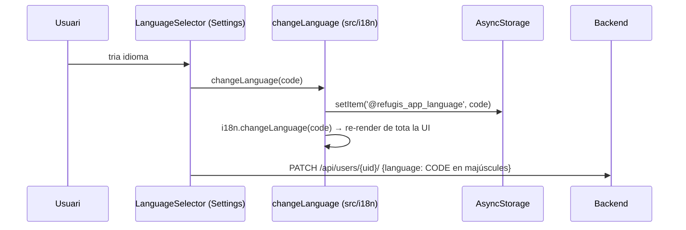

# Internacionalització (i18n)

> Migrat i actualitzat des de l'antiga `README/I18N_IMPLEMENTATION.md` (octubre 2026). Document fill de [ARCHITECTURE.md](../ARCHITECTURE.md) (§1 stack, §7 convencions).
> Llegenda: **[FET]** comprovat al codi · **[INFERÈNCIA]** deducció.

## Peces
| Peça | Fitxer |
|---|---|
| Inicialització, idiomes suportats, `changeLanguage`, `getCurrentLanguage` | `src/i18n/index.ts` |
| Traduccions | `src/i18n/locales/{ca,es,en,fr}.json` (un sol namespace `translation`) |
| Hook | `src/hooks/useTranslation.ts` (embolcall de `react-i18next`) |
| Selector a Settings | `src/components/LanguageSelector.tsx` |
| Inicialització a l'arrencada | `import './src/i18n'` a `App.js` |

Llibreries: `i18next` + `react-i18next`, amb `compatibilityJSON: 'v4'` i `useSuspense: false` **[FET]**.

## Selecció de l'idioma
1. **Idioma desat**: AsyncStorage, clau `@refugis_app_language` (`src/i18n/index.ts:22`).
2. Si no n'hi ha, **idioma del dispositiu** (`getDeviceLanguage`): `SettingsManager` a iOS, `I18nManager.localeIdentifier` a Android; es queda amb el codi (`ca_ES` → `ca`).
3. Si l'idioma no és `ca|es|en|fr` → `ca`. `fallbackLng: 'ca'` per a claus que falten en una locale.
4. **Després del login**, el listener d'`AuthContext` aplica l'idioma del perfil del backend (`toLowerCase()`, `AuthContext.tsx:86`).

## Canvi d'idioma

Problemes coneguts del flux (majúscules, `null` sense rollback): [flows/03](../flows/03-profile-settings-account.md#gotchas-i-bugs).

## Ús en codi
```tsx
import { useTranslation } from '../hooks/useTranslation';

export function MyScreen() {
  const { t } = useTranslation();
  return <Text>{t('common.search')}</Text>;
}
```
- Interpolació: `t('renovations.confirmRemoveParticipant', { name })` → `{{name}}` a la locale.
- Plurals: les locales fan servir sufixos `count` / `count_plural` (format v3), però la configuració és `compatibilityJSON: 'v4'`, que espera `count_one` / `count_other` **[FET]** → els plurals probablement no es resolen bé **[INFERÈNCIA]**.
- Fora de components (serveis), no hi ha `t()`: els serveis llancen missatges en català fixos (vegeu [GOTCHAS §23](../GOTCHAS.md)).

## Claus de primer nivell (`ca.json`)
`common`, `navigation`, `map`, `favorites`, `visited`, `renovations`, `profile`, `changePassword`, `changeEmail`, `refuge`, `filters`, `layers`, `alerts`, `permissions`, `login`, `signup`, `editProfile`, `auth` (inclou `auth.errors.*` per a `AuthService.getErrorMessageKey`), `createRenovation`, `deleteRefuge`, `editRefuge`, `createRefuge`, `doubts`, `proposals`, `experiences`, `helpSupport`, `aboutApp`, `termsAndConditions`.

## Afegir textos o idiomes
- **Text nou**: afegeix la clau a **les quatre** locales i usa `t('seccio.clau')`. Claus que avui falten: [TECH_DEBT B7](../TECH_DEBT.md).
- **Idioma nou**: fitxer a `src/i18n/locales/`, entrada a `LANGUAGES` i a `resources` (`src/i18n/index.ts`), opció al `LanguageSelector` i al wizard de `SignUpScreen`, i comprovar que el backend accepta el codi.

## Gotchas
- Canvia l'idioma sempre amb `changeLanguage` de `src/i18n` (desa a AsyncStorage); `SignUpScreen.tsx:73` usa `i18n.changeLanguage` directe i no es persisteix **[FET]**.
- Encara hi ha strings hard-coded fora d'i18n ([TECH_DEBT B6](../TECH_DEBT.md)).
