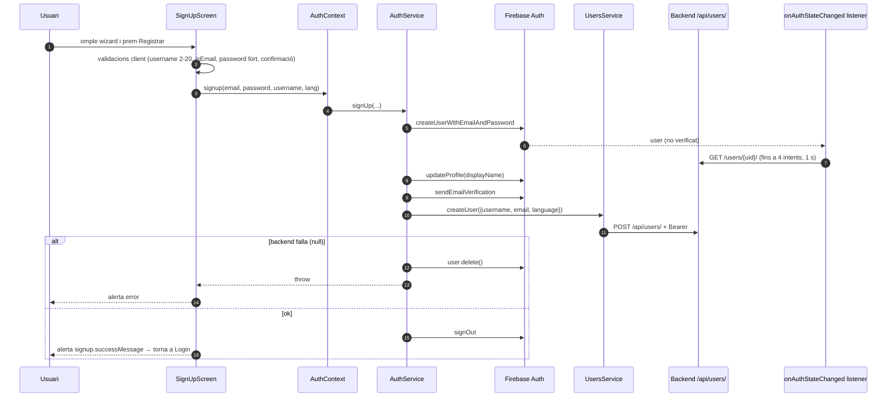

# Flux 1 — Registre (email/contrasenya)

> **[FET]** comprovat al codi · **[INFERÈNCIA]** deducció · **[NO VERIFICAT]** depèn de config externa.

## Peces
| Capa | Fitxer |
|---|---|
| Pantalla | `src/screens/SignUpScreen.tsx` (wizard: idioma → username → email → password → confirmació → registre, L51) |
| Context | `src/contexts/AuthContext.tsx:125-128` (`signup`) |
| Servei | `src/services/AuthService.ts:56-102` (`signUp`) |
| HTTP | `src/services/UsersService.ts:43-62` (`createUser` → `POST /api/users/`) |
| Firebase | `src/services/firebase.ts` |

## Diagrama

## Passos
1. Validació client: username 2-20 (`SignUpScreen.tsx:105-127`), `validator.isEmail` (130-150), contrasenya ≥8 amb minúscula, majúscula, dígit i `!@#$%^&*` (198-216), confirmació (178-196).
2. `handleSignUp` (218-289) crida `signup`. L'error `emailInUse` s'emmascara com a `signup.errors.registrationFailed` (L282).
3. `AuthService.signUp`: `createUserWithEmailAndPassword` (59) → `updateProfile` (68) → `sendEmailVerification` (73) → `getIdToken` (76) → `UsersService.createUser` (79-85) → si `null`, `firebaseUser.delete()` (87-91) → `signOut` (94).
4. L'usuari no entra a l'app fins que verifica l'email: `isAuthenticated = !!firebaseUser && firebaseUser.emailVerified` (`AuthContext.tsx:245`).

## Gotchas i bugs
- El correu de verificació s'envia **abans** de crear l'usuari al backend; si el backend falla, l'usuari rep un correu d'un compte esborrat **[FET]** (`AuthService.ts:73` vs `85`).
- El body de `POST /users/` inclou `email`, que el backend no espera (`UsersService.ts:11-16`) **[FET]**; el backend l'ignora **[INFERÈNCIA]**.
- L'idioma triat al wizard es canvia amb `i18n.changeLanguage` directe (`SignUpScreen.tsx:73`), no amb el helper que el desa a AsyncStorage **[FET]**.
- Clau i18n inexistent `signup.errors.usernameTooShort` (`SignUpScreen.tsx:80,227`) → es mostra la clau crua **[FET]**.
- String hard-coded `'Si us plau, selecciona un idioma'` (`SignUpScreen.tsx:251`) **[FET]**.
- Els termes i condicions (`src/components/TermsAndConditionsModal.tsx`) només s'obren des de Login i no es registra cap acceptació **[FET]**.
- El listener d'auth fa reintents de `GET /users/{uid}/` mentre `signUp` encara crea l'usuari, sense guarda de cancel·lació → `backendUser` pot quedar desfasat **[INFERÈNCIA]** (`AuthContext.tsx:53-110`).
