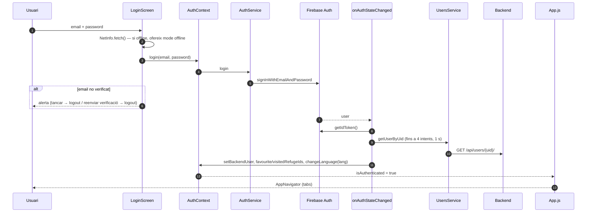
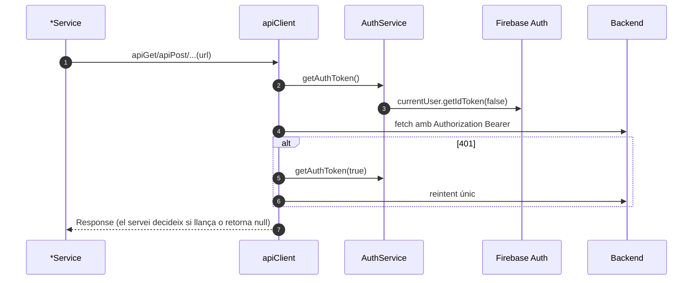

# Flux 2 — Login (email i Google), sessió, token i logout

> **[FET]** comprovat al codi · **[INFERÈNCIA]** deducció · **[NO VERIFICAT]** depèn de config externa.

## Peces
| Capa | Fitxer |
|---|---|
| Arrel i selecció de pantalla | `App.js:17-90` |
| Pantalla | `src/screens/LoginScreen.tsx` |
| Context | `src/contexts/AuthContext.tsx` |
| Servei | `src/services/AuthService.ts` |
| Client HTTP | `src/services/apiClient.ts` |
| Rol admin | `src/utils/authUtils.ts:7-24` |

## Selecció de l'arbre de pantalles (`App.js`)
- `isLoading` → spinner (L50-56).
- `isAuthenticated || isOfflineMode` → `AppNavigator` (L61-62).
- Si no → `SignUpScreen` o `LoginScreen` segons estat local `showSignUp` (L63-71). Login/SignUp **no** estan dins de cap navigator.
- Si en mode offline torna la connexió, `NetInfo` crida `exitOfflineMode()` (L22-34).

## Diagrama — login email

## Diagrama — petició autenticada i refresc de token

## Passos
- **Login email**: `LoginScreen.handleLogin` (67-204) → `AuthService.login` (`AuthService.ts:110-125`). Errors via `AuthService.getErrorMessageKey` (claus `auth.errors.*`).
- **Google**: `LoginScreen.handleGoogleLogin` (232-262) → `AuthService.loginWithGoogle` (134-203): `@react-native-google-signin/google-signin` (requerit condicionalment, L25-31) amb `webClientId` = variable `FIREBASE_WEB_CLIENT_ID` → `GoogleAuthProvider.credential(idToken)` → `signInWithCredential` → `GET /users/{uid}/` → si no existeix, `POST /users/` amb `language: 'ca'`.
- **Recuperar contrasenya**: `LoginScreen.handleForgotPassword` (264-311) → `sendPasswordResetEmail` (`AuthService.ts:223-230`). Firebase envia el correu (plantilla configurable a la consola, enllaç amb caducitat) i la nova contrasenya s'introdueix a la pàgina allotjada per Firebase, no a l'app; després l'usuari torna a fer login.
- **Reenviar verificació**: des de l'alerta d'email no verificat → `AuthService.resendVerificationEmail` (237-255) i logout.
- **Logout**: `SettingsScreen.tsx:179-204` → `AuthService.logout` = `signOut(auth)` (`AuthService.ts:208-216`); el listener buida l'estat del context (`AuthContext.tsx:102-107`).
- **Token**: `apiClient` (`src/services/apiClient.ts:36-79`) afegeix el Bearer i, en 401, força refresc i reintenta **una** vegada.
- **Admin**: `isUserAdmin()` llegeix `getIdTokenResult().claims.role === 'admin'` (`src/utils/authUtils.ts:7-24`); únic consumidor: `SettingsScreen.tsx:32-38` (mostra l'accés a gestió de propostes).
- **Mode offline**: `enterOfflineMode`/`exitOfflineMode` (`AuthContext.tsx:221-239`) deixen entrar a `AppNavigator` sense usuari.

## Gotchas i bugs
- **Sense persistència de sessió**: `getAuth(app)` sense `initializeAuth` + `getReactNativePersistence` (`src/services/firebase.ts:60-61`; el comentari diu que es configurarà després i no es fa) **[FET]** → amb Firebase JS a React Native la sessió és en memòria i cal tornar a fer login a cada arrencada **[INFERÈNCIA]**.
- **Logout no buida la cache de React Query** (cap `queryClient.clear/removeQueries/resetQueries` a `src/`) **[FET]** → dades d'un usuari visibles per al següent (p. ex. `is_visitor` a visites) **[INFERÈNCIA]**.
- Logout no fa `GoogleSignin.signOut()` **[FET]**.
- Google: usuari backend creat amb `language: 'ca'` fix (`AuthService.ts:180`) i si el `POST` falla només es loggeja (185-189) → usuari sense fila al backend **[FET]**.
- Carrera entre els reintents del listener (3 × 1 s) i el `POST /users/` del flux Google; amb el backend en *cold start* de Render `backendUser` pot quedar `null` **[INFERÈNCIA]**.
- `isUserAdmin` no força refresc del token: un canvi de rol no es veu fins al refresc horari **[FET + INFERÈNCIA]**.
- `AuthContext.authToken` i els paràmetres `authToken?` de `UsersService` **no s'usen** per a les peticions: `apiClient` sempre llegeix `auth.currentUser` **[FET]**.
- El refresc de token és només un reintent en 401: no hi ha cua, refresc proactiu ni `onIdTokenChanged` **[FET]** (motivació i límits: [integrations/firebase-auth-google.md](../integrations/firebase-auth-google.md#tokens)).
- Strings hard-coded en català a les alertes offline i de Google (`LoginScreen.tsx:95-105,169-179,236`) **[FET]**.
- Si l'alerta "email no verificat" es tanca amb el botó enrere d'Android, no es fa logout **[INFERÈNCIA]** (`LoginScreen.tsx:116-149` + `CustomAlert` `onRequestClose`).
