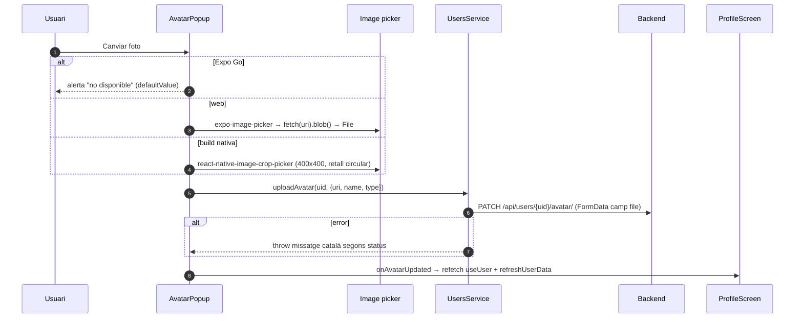
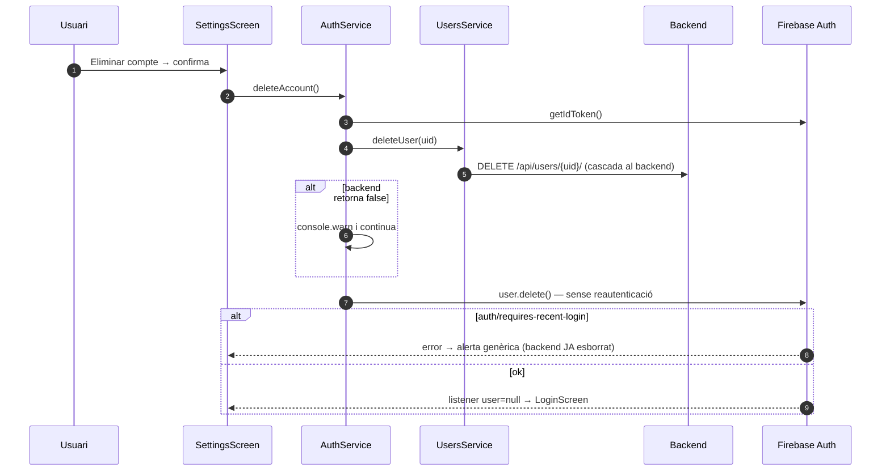

# Flux 3 — Perfil, avatar, configuració, idioma i esborrat de compte

> **[FET]** comprovat al codi · **[INFERÈNCIA]** deducció · **[NO VERIFICAT]** depèn de config externa.

## Pantalles i peces
| Funcionalitat | Entrada | Servei / Firebase |
|---|---|---|
| Veure perfil | `src/screens/ProfileScreen.tsx` (`useUser`, `useVisitedRefuges`, L40-41) | `GET /api/users/{uid}/`, `GET /api/users/{uid}/visited-refuges/` |
| Avatar | `src/components/AvatarPopup.tsx` | `PATCH`/`DELETE /api/users/{uid}/avatar/` (`src/services/UsersService.ts:369-459`) |
| Nom d'usuari | `src/screens/EditProfileScreen.tsx:51-91` → `AuthContext.updateUsername` (198-219) | `PATCH /api/users/{uid}/` |
| Email | `src/screens/ChangeEmailScreen.tsx:51-109` → `AuthService.changeEmail` (421-463) | Firebase `reauthenticateWithCredential` + `verifyBeforeUpdateEmail` |
| Contrasenya | `src/screens/ChangePasswordScreen.tsx:82-142` → `AuthService.changePassword` (392-411) | Firebase `reauthenticateWithCredential` + `updatePassword` |
| Idioma | `src/screens/SettingsScreen.tsx:91-101` → `src/components/LanguageSelector.tsx:23-61` | `changeLanguage` + `PATCH /api/users/{uid}/ {language}` |
| Esborrar compte | `src/screens/SettingsScreen.tsx:153-177` → `AuthService.deleteAccount` (317-342) | `DELETE /api/users/{uid}/` + `user.delete()` |

## Diagrama — pujar avatar

## Diagrama — esborrar compte

## Gotchas i bugs
- **Esborrat de compte**: backend primer, Firebase després i sense reautenticar. Si Firebase demana login recent, queda un compte d'Auth sense fila al backend; al següent login `GET /users/{uid}/` fa 404 i `backendUser` queda `null` **[FET ordre / INFERÈNCIA conseqüència]** (`AuthService.ts:328-335`).
- **Idioma**: `UsersService.updateUser` retorna `null` en lloc de llançar → `onError` no s'executa; `onSuccess` fa `reloadUser`, que torna a llegir l'idioma **antic** del backend i reverteix la UI **[FET + INFERÈNCIA]** (`LanguageSelector.tsx:37-49`, `src/hooks/useUsersQuery.ts:376-381`).
- Idioma enviat en **majúscules** (`'CA'`, `LanguageSelector.tsx:35`) però en minúscules al registre i a Google (`AuthService.ts:82,180`); el lector fa `toLowerCase()` (`AuthContext.tsx:86`) **[FET]**. El backend valida `ca|es|en|fr` **[NO VERIFICAT si accepta majúscules]**.
- Canviar email **no** actualitza res al backend; la branca `BACKEND_UPDATE_FAILED` (`ChangeEmailScreen.tsx:101`) és codi mort **[FET]**.
- Canviar email/contrasenya s'ofereix també a usuaris de Google, però la reautenticació usa `EmailAuthProvider` **[FET]** → no pot funcionar **[INFERÈNCIA]**.
- `updateUsername` envia el valor sense `trim()` (`EditProfileScreen.tsx:73`) i no actualitza el `displayName` de Firebase **[FET]**.
- `AvatarPopup` no usa React Query: depèn d'un callback de refetch **[FET]**. Missatges d'error en català fixos al servei (`UsersService.ts:393-405,438-448`) **[FET]**.
- Claus i18n `profile.avatar.expoGoTitle/expoGoMessage` no existeixen (es mostra el `defaultValue`) **[FET]**.
