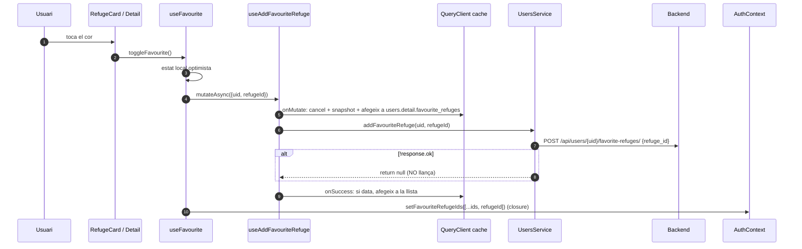

# Flux 4 — Refugis preferits i visitats

> **[FET]** comprovat al codi · **[INFERÈNCIA]** deducció · **[NO VERIFICAT]** depèn de config externa.

## Peces
| Capa | Fitxer |
|---|---|
| Entrades UI | `src/screens/RefugeDetailScreen.tsx:133,280-288`, `src/components/RefugeCard.tsx:30,56-62`, `src/components/RefugeBottomSheet.tsx:58,103-109` (preferit); `src/components/QuickActionsMenu.tsx:72,139-145` (visitat) |
| Hooks de toggle | `src/hooks/useFavourite.ts`, `src/hooks/useVisited.ts` |
| Mutacions/queries | `src/hooks/useUsersQuery.ts` (add/remove favourite 56-192, visited 217-353, llistes 38-49) |
| Servei | `src/services/UsersService.ts:166-356` |
| Llista | `src/screens/FavoritesScreen.tsx` |
| Estat global | `AuthContext.favouriteRefugeIds/visitedRefugeIds` (`src/contexts/AuthContext.tsx:49-50,81-82`) |

Hi ha **dues fonts de veritat**: els arrays d'IDs del context i la cache de React Query (`['users','detail',uid]`, `['users',uid,'favouriteRefuges']`, `['users',uid,'visitedRefuges']`) **[FET]**.

## Diagrama

## Gotchas i bugs
- **Fallades reportades com a èxit**: tots els mètodes de llistes de `UsersService` retornen `null`/`false` en error en lloc de llançar → els `onError` (rollback) no s'executen i `useFavourite`/`useVisited` actualitzen el context igualment **[FET]** (`UsersService.ts:209-227,245-255,309-327,345-355`; `useFavourite.ts:40,47`; `useVisited.ts:40,47`).
- **Closure obsoleta**: `setFavouriteRefugeIds([...favouriteRefugeIds, id])` amb l'array capturat; dos toggles ràpids en targetes diferents poden perdre un canvi **[INFERÈNCIA]**. Cal `setState` funcional.
- Errors silenciosos a `RefugeCard`, `RefugeBottomSheet` i `QuickActionsMenu` **[FET]**.
- `mapperUserRefugiInfoDTO` llança si falta `coord` (`src/services/mappers/RefugiMapper.ts:132-147`) i el servei ho converteix en `null` **[FET]**.
- `src/hooks/index.ts:7-8` fa `export *` de mòduls amb només `export default` → no reexporta `useFavourite`/`useVisited` **[FET]**.
- `AppNavigator.handleToggleFavorite` és un no-op (`src/components/AppNavigator.tsx:58-68`) **[FET]**.
