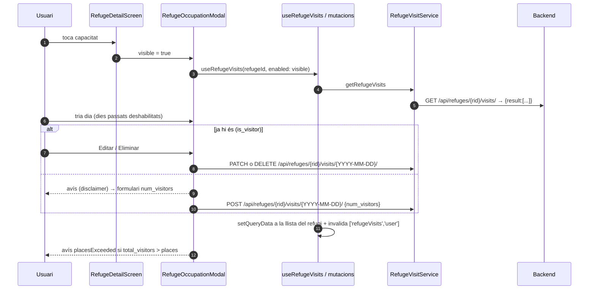

# Flux 5 — Ocupació / visites planificades d'un refugi

> **[FET]** comprovat al codi · **[INFERÈNCIA]** deducció · **[NO VERIFICAT]** depèn de config externa.

## Peces
| Capa | Fitxer |
|---|---|
| Entrada | `src/screens/RefugeDetailScreen.tsx:844-850` (targeta de capacitat) → modal muntat a L1176-1182 |
| Modal | `src/components/RefugeOccupationModal.tsx` |
| Hooks | `src/hooks/useRefugeVisitsQuery.ts` (claus `['refugeVisits','refuge',id]`, `['refugeVisits','user',uid]`) |
| Servei | `src/services/RefugeVisitService.ts` |

## Diagrama

## Passos
- Calendari amb setmana començant en dilluns; dies passats deshabilitats comparant strings de data (`RefugeOccupationModal.tsx:67-82`).
- Crear (151-178), editar (181-215), eliminar (218-233). Errors via `error.message`.
- Hooks: create (46-85) i update (90-120) fan `setQueryData` + invalidació de visites d'usuari; delete (125-146) invalida.
- Servei: tots els endpoints (`RefugeVisitService.ts:55-261`) coincideixen amb el backend **[FET]**; llança missatges en català segons status.

## Gotchas i bugs
- `is_visitor`/`num_visitors` són per usuari però la clau de cache és per refugi; sense buidat de cache al logout, un altre usuari pot veure dades de l'anterior durant `gcTime` (15 min) **[INFERÈNCIA]**.
- `useUserVisits` (`useRefugeVisitsQuery.ts:32-41`) no s'usa enlloc **[FET]**.
- Claus fora del registre `queryKeys` **[FET]**.
- String en anglès hard-coded (`RefugeOccupationModal.tsx:186`) **[FET]**.
- En mode offline el modal fa una petició que acaba en 401 **[INFERÈNCIA]**.
