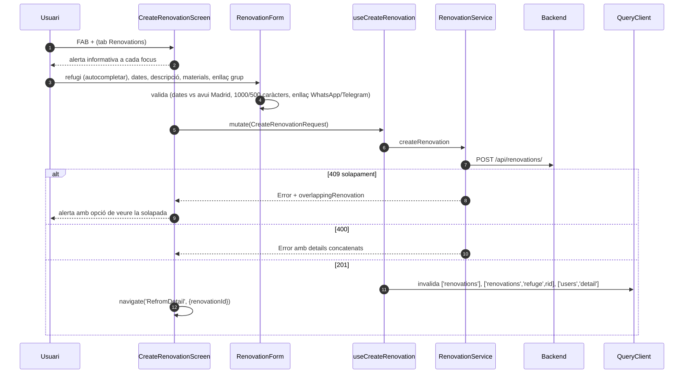
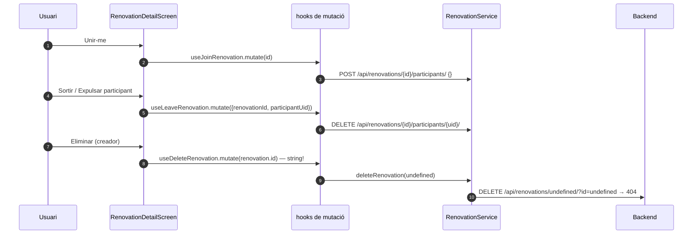

# Flux 6 — Renovations (reformes)

> **[FET]** comprovat al codi · **[INFERÈNCIA]** deducció · **[NO VERIFICAT]** depèn de config externa.

És el **domini de referència** del patró de capes del frontend (vegeu [ARCHITECTURE §3](../ARCHITECTURE.md)).

## Peces
| Capa | Fitxer |
|---|---|
| Llista (tab) | `src/screens/RenovationsScreen.tsx` |
| Crear / editar | `src/screens/CreateRenovationScreen.tsx`, `src/screens/EditRenovationScreen.tsx`, `src/components/RenovationForm.tsx` |
| Detall | `src/screens/RenovationDetailScreen.tsx` (ruta registrada com **`RefromDetail`**, `src/components/AppNavigator.tsx:211`) |
| Targeta | `src/components/RenovationCard.tsx` |
| Hooks | `src/hooks/useRenovationsQuery.ts` |
| Servei | `src/services/RenovationService.ts` |
| DTO / mapper / model | `src/services/dto/RenovationDTO.ts`, `src/services/mappers/RenovationMapper.ts`, `src/models/index.ts:93` |

## Diagrama — crear

## Diagrama — unir-se / sortir / esborrar

## Passos
- Llista: `useRenovations()` + `useRefugesBatch(ids)`; separa "les meves" (creador o participant) de la resta (`RenovationsScreen.tsx:45-82`).
- Detall: carrega renovation, refugi, creador i participants (`RenovationDetailScreen.tsx:61-76`); l'enllaç de grup es mostra a creador **i** participants (338-359) i s'obre amb `Linking.openURL` (110-114).
- Servei: `GET /renovations/` (46-61), `GET /renovations/{id}/` (67-86), `GET /refuges/{id}/renovations/` (95-110), `POST` (118-154), `PATCH` (168), `DELETE` (209), join/leave (237-301).

## Gotchas i bugs
- **Esborrar renovation està trencat**: `deleteMutation.mutate(renovation.id)` (`RenovationDetailScreen.tsx:199`) però el hook espera `{id, refugeId}` (`useRenovationsQuery.ts:108`) → `DELETE /api/renovations/undefined/` **[FET]**.
- Ruta amb errata `RefromDetail` (AppNavigator i 5 crides) mentre la pantalla es tipa com `'RenovationDetail'` (`RenovationDetailScreen.tsx:40`) **[FET]**.
- EditRenovation: el botó "veure solapada" del 409 obre la renovation actual (`EditRenovationScreen.tsx:112-117`) **[FET]**.
- `materials_needed` no es pot buidar en editar (s'envia `undefined` i `JSON.stringify` l'elimina, `RenovationForm.tsx:277-278`); >500 caràcters bloqueja l'enviament sense missatge (232-234) **[FET]**.
- `getRenovationById` converteix qualsevol error en `null` → "Renovation not found" (`RenovationService.ts:82-85`) **[FET]**.
- `?id=` redundant a PATCH i DELETE (`RenovationService.ts:168,209`) **[FET]**.
- Join/leave no invaliden `['users','detail']` tot i que el backend canvia `num_renovated_refuges` **[FET]**.
- `useUsers` i `useRefugesBatch` fan `.sort()` in-place sobre arrays que poden venir de la cache (`useUsersQuery.ts:391`, `useRefugesQuery.ts:46`) **[FET]**.
- `Linking.openURL` sense `catch` ni `canOpenURL` (`RenovationDetailScreen.tsx:112`, `RenovationCard.tsx:46`) **[FET]**.
- El mapper descarta `expelled_uids` (`RenovationMapper.ts:11-22`) **[FET]**: la UI no sap si l'usuari ha estat expulsat fins que el backend respon 403 **[INFERÈNCIA]**.
- CreateRenovation queda a la pila després de crear (`CreateRenovationScreen.tsx:65`) **[FET]**.
