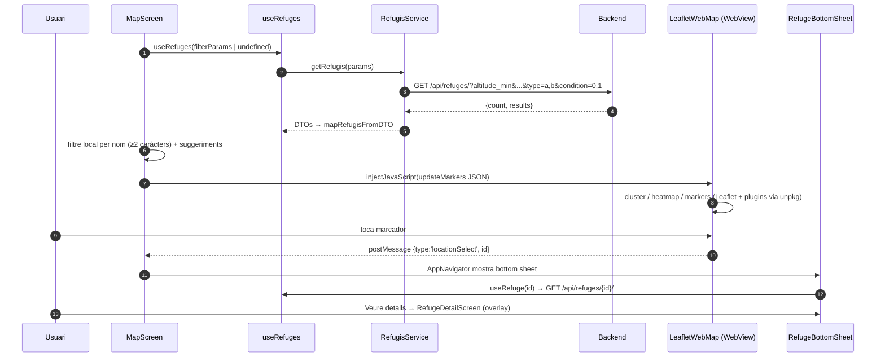
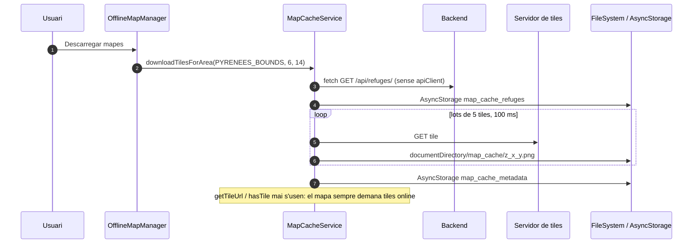

# Flux 7 — Mapa, cerca, filtres i mapes offline

> **[FET]** comprovat al codi · **[INFERÈNCIA]** deducció · **[NO VERIFICAT]** depèn de config externa.

## Peces
| Capa | Fitxer |
|---|---|
| Tab | `src/components/TabsNavigator.tsx:53-96` (Map) |
| Pantalla | `src/screens/MapScreen.tsx` |
| Mapa | `src/components/MapViewComponent.tsx` → `src/components/LeafletWebMap.tsx` (WebView + Leaflet) |
| Filtres / cerca / capes | `src/components/FilterPanel.tsx`, `src/components/SearchBar.tsx`, `src/components/LayerSelector.tsx` |
| Fitxa ràpida | `src/components/RefugeBottomSheet.tsx` |
| Hook | `src/hooks/useRefugesQuery.ts:13-24` (`useRefuges`), `useRefuge` |
| Servei | `src/services/RefugisService.ts:33-91` (`getRefugis`), `12-30` (`getRefugiById`) |
| Offline | `src/components/OfflineMapManager.tsx`, `src/services/MapCacheService.ts` |

## Diagrama — càrrega i selecció

## Diagrama — descàrrega offline

## Passos
- Filtres al servidor: `Filters {types, altitude[0..3250], places[0..30], condition[]}` (`MapScreen.tsx:21-22,40-45`) → `filterParams` (48-74) amb `type` i `condition` separats per comes.
- Cerca per nom: **client-side** sobre la llista carregada (`MapScreen.tsx:133-149`); el paràmetre `search → name` del servei (`RefugisService.ts:45-46`) no s'usa.
- Sense filtres el backend retorna la llista de coordenades (id, name, surname, coord, geohash); el mapper la tracta com un `RefugiDTO` complet i perd `geohash` (`src/services/mappers/RefugiMapper.ts:91-127`) **[FET]**.
- Capes: OpenTopoMap per defecte o OpenStreetMap (`LeafletWebMap.tsx:221-228`); representació `cluster` (`maxClusterRadius` 80, sense clúster a zoom ≥12), heatmap o markers.
- "Localitza'm": `expo-location` → `setUserLocation` → injecció a la WebView amb zoom 8 (`MapViewComponent.tsx:67-112`).
- Mode offline: `MapScreen.tsx:80-113` llegeix `MapCacheService.getOfflineRefuges()`.

## Gotchas i bugs
- **Els mapes offline no funcionen**: les tiles es descarreguen però cap codi les llegeix (`MapCacheService.ts:212-234` sense ús) i Leaflet es carrega de la CDN unpkg (`LeafletWebMap.tsx:163-176`) **[FET]** → offline només funciona la llista de refugis **[INFERÈNCIA]**.
- Descàrrega de ~45.640 tiles **[INFERÈNCIA, càlcul]**; una sola fallada marca la cache com a incompleta (`MapCacheService.ts:195`); la política d'ús de tiles d'OpenTopoMap/OSM desaconsella descàrregues massives **[INFERÈNCIA]**.
- Marcadors obsolets quan un filtre retorna 0 resultats: només s'injecta si `locations.length > 0` (`LeafletWebMap.tsx:54`) **[FET]**.
- Hooks dins el render-prop del `Tab.Screen` i `onLocationSelect(null)` en perdre el focus, que deixa `showBottomSheet=true` amb ubicació nul·la (`TabsNavigator.tsx:70-84`, `AppNavigator.tsx:123-126`) **[FET]**.
- El HTML de la WebView es regenera quan arriba l'estat de la cache (`LeafletWebMap.tsx:546`) → recàrrega del mapa **[INFERÈNCIA]**.
- `CustomEvent` despatxat al `window` de RN mai arriba a la WebView (`MapViewComponent.tsx:97-100`) **[FET]**.
- Strings en català fixos a `OfflineMapManager.tsx` i `MapViewComponent.tsx:87,102` **[FET]**.
- Els màxims de filtre (30 places, 3250 m) s'envien com a límit superior quan es toca el filtre i exclouen refugis per sobre **[INFERÈNCIA]**.
