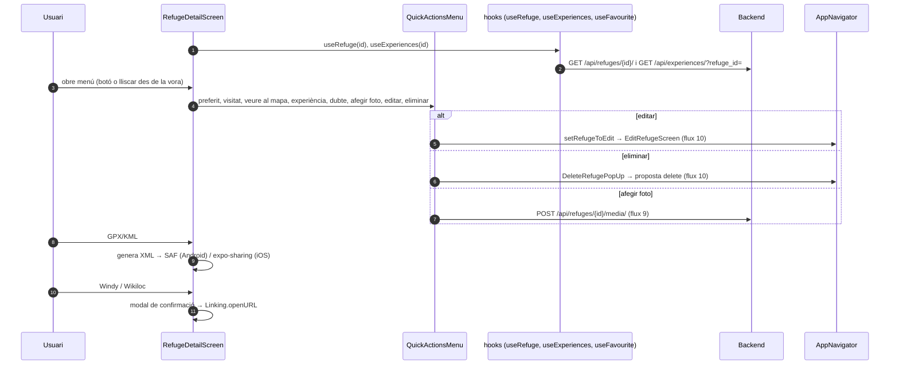

# Flux 8 — Detall d'un refugi

> **[FET]** comprovat al codi · **[INFERÈNCIA]** deducció · **[NO VERIFICAT]** depèn de config externa.

## Entrades
- Overlay des del bottom sheet: `src/components/AppNavigator.tsx:275-300`.
- Ruta de pila `RefugeDetail` (param `refugeId`): `AppNavigator.tsx:224-259`.
La mateixa pantalla viu **en dos llocs** (overlay per estat local i ruta de pila); Edit, Doubts i Experiences també existeixen com a overlay i com a ruta **[FET]**.

## Dades (`src/screens/RefugeDetailScreen.tsx`)
| Dada | Hook / servei | Línia |
|---|---|---|
| Refugi | `useRefuge(id)` → `GET /api/refuges/{id}/` | 132 |
| Preferit | `useFavourite(id)` | 133 |
| Experiències (preview 3) | `useExperiences(id)` → `GET /api/experiences/?refuge_id=` | 136-144 |
| Ocupació | `RefugeOccupationModal` (flux [05](05-refuge-visits-occupation.md)) | 844-850, 1176-1182 |

Seccions en ordre: carrusel (3 fotos + pàgina de botons, 725-809) · títol i badges (813-828) · estadístiques (831-853) · descripció amb "llegir més" (857-884) · serveis `info_comp` (887-903) · coordenades + GPX/KML (906-934) · Windy/Wikiloc (938-965) · enllaços (968-984) · dubtes (987-996) · experiències (999-1042) · avís legal (1044-1046).

## Diagrama

## Gotchas i bugs
- `RefugisService.getRefugiById` retorna `null` en error (no llança) → React Query no reintenta i la pantalla mostra només `t('common.error')` (`RefugisService.ts:18-29`, `RefugeDetailScreen.tsx:218-237`) **[FET]**.
- **`condition = 0` es perd**: `refugiDTO.condition || determineCondition(...)` (`src/services/mappers/RefugiMapper.ts:111`) substitueix "pobre" (0) per una heurística **[FET]**. Cal `??`.
- `CustomAlert` és dins `{!galleryScreenVisible && ...}` → les alertes de pujada llançades des de la galeria no es veuen (`RefugeDetailScreen.tsx:704-1195`) **[FET segons informe, rang verificat]**.
- La prop `onNavigate` no s'usa; `AppNavigator.handleNavigate` només mostra una alerta (`AppNavigator.tsx:118-120`) **[FET]**.
- "Compartir experiència" no comparteix: obre Experiences; `Share` importat sense ús (`QuickActionsMenu.tsx:11`) **[FET]**.
- Strings fixes ("Motiu: El sistema no pot obrir...", `RefugeDetailScreen.tsx:503`; 'N/A' a 835,841) i imatge de reserva d'Unsplash (764) **[FET]**.
- Helper de detecció de vídeo i mapa d'icones de serveis copiats en diversos fitxers (`RefugeDetailScreen.tsx:70,250-263`, `GalleryScreen.tsx:35`, `PhotoViewerModal.tsx:44`, `RefugeBottomSheet.tsx:13`, `UserExperience.tsx:39`) **[FET]**.
