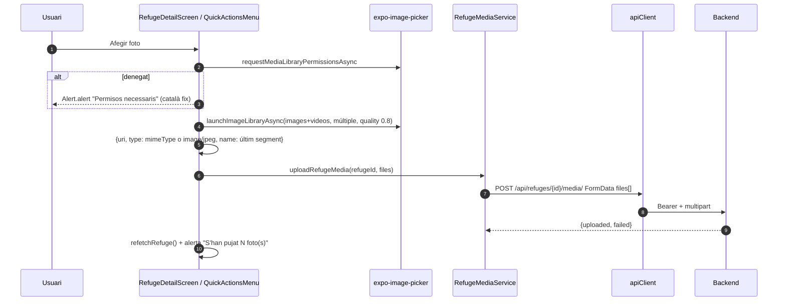
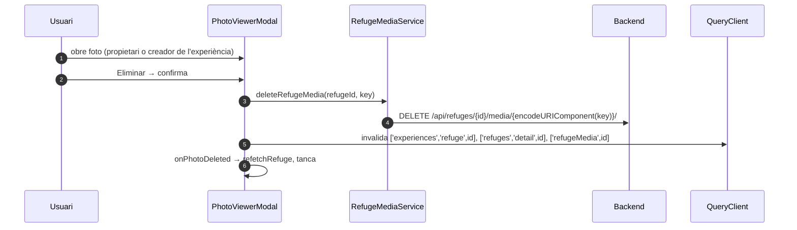

# Flux 9 — Pujar fotos a un refugi, galeria i esborrar foto

> **[FET]** comprovat al codi · **[INFERÈNCIA]** deducció · **[NO VERIFICAT]** depèn de config externa.

## Peces
| Capa | Fitxer |
|---|---|
| Pujada (còpia 1) | `src/screens/RefugeDetailScreen.tsx:542-599` (`handleUploadPhotos`; botó del carrusel 778-790 i estat buit de la galeria 699) |
| Pujada (còpia 2) | `src/components/QuickActionsMenu.tsx:165-225` (`handleAddPhoto`) |
| Galeria | `src/screens/GalleryScreen.tsx` (graella de 3 columnes) |
| Visor / esborrat | `src/components/PhotoViewerModal.tsx` |
| Servei | `src/services/RefugeMediaService.ts` (`uploadRefugeMedia` 108-159, `deleteRefugeMedia` 172-210) |
| Hooks (no usats) | `src/hooks/useRefugeMediaQuery.ts` (`useRefugeMedia` 12-21, `useUploadRefugeMedia` 27-60, `useDeleteRefugeMedia` 66) |

## Diagrama — pujar

## Diagrama — esborrar

## Gotchas i bugs
- **URL incorrecta** a `RefugeMediaService.getRefugeMedia`: `/refugis/{id}/media/` en lloc de `/refuges/` (`RefugeMediaService.ts:59`) **[FET]**; ara és codi mort perquè `useRefugeMedia` no s'usa.
- La pujada **no** usa `useUploadRefugeMedia`: crida el servei directament i està duplicada en dos fitxers → no s'invaliden `['users','detail']` (comptador de fotos) ni `['refuges','list']` **[FET]**.
- L'esborrat tampoc usa `useDeleteRefugeMedia` i no invalida l'usuari ni la llista **[FET]**.
- `PhotoViewerModal` usa la clau `['user', uid]` en lloc de `['users','detail',uid]` → cache duplicada (`PhotoViewerModal.tsx:109`) **[FET]**.
- Cap compressió: `expo-image-manipulator` és a `package.json` però no s'importa; només `quality: 0.8`. `aspect` sense `allowsEditing` no té efecte **[FET + INFERÈNCIA]**.
- El nom de fitxer és l'últim segment de la URI local; el backend fa servir el nom original a la clau R2 → col·lisions possibles (vegeu docs del backend) **[INFERÈNCIA d'integració]**.
- Alertes i textos en català fixos (`RefugeDetailScreen.tsx:549-550,592,595`; `QuickActionsMenu.tsx:172-173,217,220`; `PhotoViewerModal.tsx:145-153,172,252`) **[FET]**.
- Detecció de vídeo per extensió de la URL **[FET]**.
