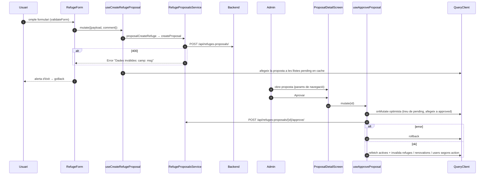

# Flux 10 — Crear, editar i eliminar refugis via propostes, i revisió admin

> **[FET]** comprovat al codi · **[INFERÈNCIA]** deducció · **[NO VERIFICAT]** depèn de config externa.

Els usuaris no modifiquen refugis directament: envien **propostes** que un admin aprova o rebutja. Els hooks `useCreateRefuge/useUpdateRefuge/useDeleteRefuge` de `src/hooks/useRefugesQuery.ts:76-130` només llancen "Use RefugeProposalsService..." **[FET]**.

## Peces
| Acció | Entrada | Hook | Servei → endpoint |
|---|---|---|---|
| Crear | `SearchBar` "+" → `src/screens/CreateRefugeScreen.tsx` + `src/components/RefugeForm.tsx` (`mode="create"`) | `useCreateRefugeProposal` | `proposalCreateRefuge` → `POST /api/refuges-proposals/ {action:'create', payload, comment}` |
| Editar | Detall → `src/screens/EditRefugeScreen.tsx` + `RefugeForm` (`mode="edit"`) | `useUpdateRefugeProposal` | `proposalEditRefuge` → `{refuge_id, action:'update', payload (només canvis), comment}` |
| Eliminar | QuickActions → `src/components/DeleteRefugePopUp.tsx` → `AppNavigator.handleConfirmDelete` (75-111) | `useDeleteRefugeProposal` | `{refuge_id, action:'delete', comment}` |
| Les meves | Settings → `Proposals {mode:'my'}` → `src/screens/ProposalsScreen.tsx` | `useMyProposals` | `GET /api/my-refuges-proposals/?status=` |
| Admin | Settings (si `isUserAdmin()`) → `Proposals {mode:'admin'}` | `useProposals` | `GET /api/refuges-proposals/?status=&refuge-id=` |
| Aprovar / rebutjar | `src/screens/ProposalDetailScreen.tsx` (+ `RejectProposalPopUp`) | `useApproveProposal` / `useRejectProposal` | `POST .../{id}/approve/` · `POST .../{id}/reject/ {reason}` |

Servei: `src/services/RefugeProposalsService.ts`; hooks: `src/hooks/useProposalsQuery.ts`; mapper: `src/services/mappers/RefugeProposalMapper.ts`; `mapPartialRefugiToDTO` (`src/services/mappers/RefugiMapper.ts:191-212`) converteix booleans d'`info_comp` a 0/1.

## Diagrama — crear proposta i aprovar-la

## Validacions (`RefugeForm.validateForm`, 291-404)
Nom obligatori; lat/long amb ≥3 decimals i sense comes; descripció i comentari ≤3000; enllaços `^(https?://|www\.)`. Editar requereix comentari ≥50 caràcters (372-379) i que hi hagi canvis (240). Eliminar i rebutjar requereixen ≥50 caràcters (`DeleteRefugePopUp.tsx:32-38`, `RejectProposalPopUp.tsx:32-39`).

## Gotchas i bugs
- **Errors mostrats com a èxit**: a `RefugeForm.tsx:515-541`, qualsevol error amb "coord" al missatge mostra l'alerta d'**èxit** i torna enrere; un 400 del backend de tipus "Dades invàlides: coord: ..." es reportaria com a èxit **[FET]**. El mateix patró silencia errors a `AppNavigator.tsx:98-108` **[FET segons informe]**.
- **Hook condicional**: `isAdminMode ? useProposals(...) : useMyProposals(...)` (`ProposalsScreen.tsx:66-68`) **[FET]**.
- Pull-to-refresh d'admin amb filtre "tots" escriu a `['proposals','list']` mentre la query viva té una altra clau → la llista visible no s'actualitza (`useProposalsQuery.ts:51-59` vs `14-19`) **[INFERÈNCIA sobre el hash de claus]**.
- `EditRefugeScreen` navega a `'RefugeDetails'` (la ruta és `'RefugeDetail'`) (`EditRefugeScreen.tsx:70`) **[FET]**.
- El rol admin a la UI només decideix si es mostra l'opció; la protecció real és el 403 del backend. Les pantalles confien en el param `mode` **[FET]**.
- `ProposalDetailScreen` llegeix la proposta dels params de navegació → no reflecteix canvis de cache; `payload` es deixa com a DTO (0/1) mentre `refuge_snapshot` es mapeja **[FET]**.
- Bloc d'actualització de llistes de propostes copiat 5 vegades a `useProposalsQuery.ts` **[FET]**.
- Etiqueta `'Admin'` fixa quan `reviewer_uid == null` i el motiu és "refuge has been deleted" (`ProposalDetailScreen.tsx:768`) — depèn del text exacte del backend **[FET]**.
