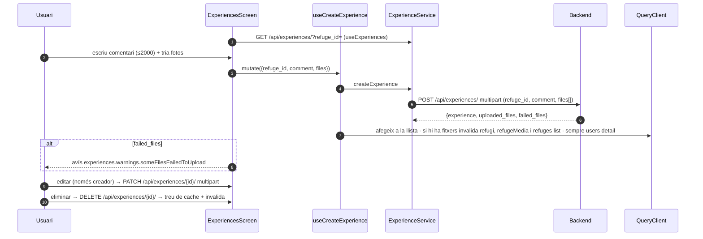

# Flux 11 — Experiències

> **[FET]** comprovat al codi · **[INFERÈNCIA]** deducció · **[NO VERIFICAT]** depèn de config externa.

## Peces
| Capa | Fitxer |
|---|---|
| Pantalla | `src/screens/ExperiencesScreen.tsx` (overlay des d'`AppNavigator.tsx:326-338`) |
| Element | `src/components/UserExperience.tsx` (edició inline) |
| Preview | `src/screens/RefugeDetailScreen.tsx:999-1042` |
| Hooks | `src/hooks/useExperiencesQuery.ts` (clau `['experiences','refuge',id]`) |
| Servei | `src/services/ExperienceService.ts` |
| Mapper | `src/services/mappers/ExperienceMapper.ts:8-19` |

## Diagrama

## Gotchas i bugs
- El botó d'editar/eliminar només es mostra si `backendUser.uid === creator_uid` (`UserExperience.tsx:96,304-315`); el backend **no** comprova la propietat (vegeu docs del backend) → la protecció és només visual **[FET a ambdós repos]**.
- MIME forçat a `video/mp4` o `image/jpeg` (`ExperiencesScreen.tsx:157`, `UserExperience.tsx:154`) → PNG/HEIC mal etiquetats; `MediaTypeOptions.All` obsolet (148) **[FET]**.
- Si el PATCH no retorna `experience`, no s'actualitza ni s'invalida res (`useExperiencesQuery.ts:102`); no es pot enviar un comentari buit (`ExperienceService.ts:155-157`) **[FET]**.
- `UserExperience.formatDate` només entén ISO/`yyyy-mm-dd` i si no mostra 'Sense data' (63-90); el DTO diu `DD/MM/YYYY` (`src/services/dto/ExperienceDTO.ts:11`) **[FET]**; format real del backend: **[NO VERIFICAT des del frontend]**.
- `refuge_id` sense codificar a la query (`ExperienceService.ts:49`) **[FET]**.
- `alert()` global a `UserExperience.tsx:134`; clau `refuge.gallery.permissionDenied` inexistent **[FET]**.
- `deleteMediaMutation` sense ús (`ExperiencesScreen.tsx:106`) **[FET]**.
