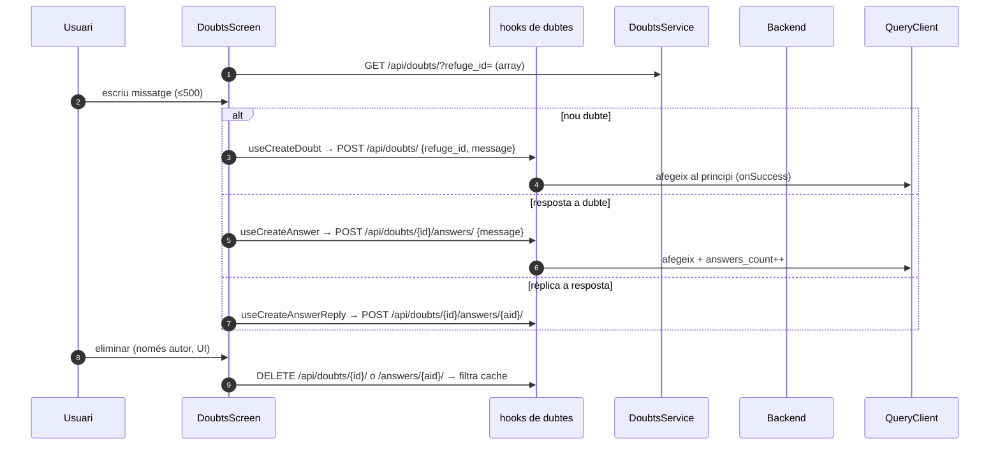

# Flux 12 — Dubtes i respostes

> **[FET]** comprovat al codi · **[INFERÈNCIA]** deducció · **[NO VERIFICAT]** depèn de config externa.

## Peces
| Capa | Fitxer |
|---|---|
| Pantalla | `src/screens/DoubtsScreen.tsx` (overlay `AppNavigator.tsx:313-324`) |
| Missatge | `src/components/UserMessage.tsx` |
| Hooks | `src/hooks/useDoubtsQuery.ts` (clau `['doubts','refuge',id]`) |
| Servei | `src/services/DoubtsService.ts` |
| Mapper | `src/services/mappers/DoubtMapper.ts:23-33` |

## Diagrama

## Gotchas i bugs
- Els botons d'eliminar només es mostren a l'autor (`UserMessage.tsx:38,82-86`), però el backend permet esborrar a qualsevol usuari autenticat → protecció només visual **[FET a ambdós repos]**.
- Les rèpliques es mostren planes: `parent_answer_id` s'ignora a la UI (`DoubtsScreen.tsx:82-94`) **[FET]**; en esborrar una resposta no es treuen les filles de la cache (`useDoubtsQuery.ts:187`) **[FET]**.
- Els comentaris diuen "optimistic" però les escriptures a cache es fan a `onSuccess` **[FET]**.
- `refuge_id` sense codificar (`DoubtsService.ts:40`) **[FET]**.
- Hooks dins `try/catch` (`DoubtsScreen.tsx:105-110`) **[FET]**.
